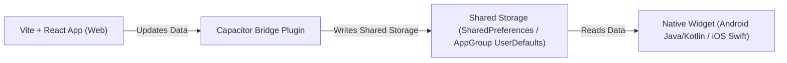

# Home Screen Widgets Implementation Proposal

Yes! It is entirely possible to add native home screen widgets (iOS WidgetKit and Android App Widgets) to our Capacitor-based application. Since home screen widgets run outside the app's main WebView, we use a **hybrid bridge architecture** to share data between React and the native OS.

---

## 📐 Conceptual Architecture

To build a widget, we use a 3-part bridge system:



1. **React State Update**: When our app loads new portfolio values, it writes the data (e.g., Total Current Value, Today's Return) to the shared storage.
2. **Native Shared Storage**:
   - **Android**: Data is stored in `SharedPreferences`.
   - **iOS**: Data is stored in `UserDefaults` configured with an shared **App Group ID** so both the main app and the Widget Extension can read it.
3. **Native Widget UI**: 
   - **Android**: Layout is designed using native XML `RemoteViews`.
   - **iOS**: Layout is built with Swift & SwiftUI `WidgetKit`.

---

## 🎨 Proposed Mutual Fund Lens Widget Designs

### 1. Minimal Portfolio Widget (Small / Medium)
- **Purpose**: A quick glance at the overall portfolio performance.
- **Content**: Total portfolio current valuation, absolute gains, and percentage changes.
- **Visuals**:
  ```
  +-----------------------+
  |  FundLens             |
  |                       |
  |  ₹1,24,532.80         |
  |  ▲ +₹296.48 (0.30%)   |
  +-----------------------+
  ```

### 2. Detailed Fund List Widget (Medium / Large)
- **Purpose**: Shows progress for individual fund investments.
- **Content**: A scrollable/stack list displaying the name of each fund, its current holding valuation, and the individual gain/loss return metrics.
- **Visuals**:
  ```
  +---------------------------------------------+
  |  My Mutual Funds                            |
  |                                             |
  |  Parag Parikh Flexi Cap                     |
  |  ₹45,210.50          ▲ +₹523.10 (+1.17%)    |
  |                                             |
  |  Axis Small Cap Fund                        |
  |  ₹32,142.10          ▼ -₹102.50 (-0.32%)    |
  |                                             |
  |  Mirae Asset Large Cap                      |
  |  ₹47,180.20          ▲ +₹212.80 (+0.45%)    |
  +---------------------------------------------+
  ```

---

## 🛠️ Step-by-Step Implementation Paths

### Option A: Using `@capgo/capacitor-widget-kit` (Recommended)
This plugin automates the setup of native bridges and allows you to easily pass data from React to the widget using JSON.

1. **Install the plugin**:
   ```bash
   npm install @capgo/capacitor-widget-kit
   npx cap sync
   ```
2. **Update from React**:
   ```javascript
   import { WidgetKit } from '@capgo/capacitor-widget-kit';

   // Send data to widget when portfolio updates
   WidgetKit.setItem({
     key: 'portfolioData',
     value: JSON.stringify({
       totalCurrent: 124532.80,
       dailyChange: 296.48,
       dailyChangePct: 0.30,
       funds: [
         { name: 'Parag Parikh Flexi Cap', current: 45210.50, change: 523.10, changePct: 1.17 },
         { name: 'Axis Small Cap Fund', current: 32142.10, change: -102.50, changePct: -0.32 },
         { name: 'Mirae Asset Large Cap', current: 47180.20, change: 212.80, changePct: 0.45 }
       ]
     }),
     group: 'group.com.anushkumar.mflens' // App Group ID for iOS
   });

   // Force widget to refresh
   WidgetKit.reloadAllTimelines();
   ```
3. **Android Setup**: Add an `AppWidgetProvider` class in the `android/` project that listens to updates and updates the native widget UI.
4. **iOS Setup**: In Xcode, add a new **Widget Extension** target and render the UI in SwiftUI reading from `UserDefaults`.

---

## 🔋 Performance & Battery Life Guidelines: Smart Sync Schedule

To keep the app fast and preserve battery, we implement a **Smart Sync Policy** mapped specifically to Indian mutual fund market behavior:

### 1. Weekday-Only Sync
- **Rule**: Updates run **only on business days (Monday to Friday)**.
- **Why**: Mutual fund NAVs do not update on weekends or public stock market holidays, so background refreshing on these days is disabled to save battery.

### 2. Twice-Daily Refresh Schedule
NAVs in India are compiled and published by AMFI after markets close. Therefore, widgets are configured to sync only twice a day at crucial moments:
- **Morning Sync (9:30 AM IST)**: Updates the widget once markets open to display the final consolidated NAVs from the previous day.
- **Late Evening Sync (10:00 PM IST)**: Refreshes to fetch the newly declared NAVs for the current business day (which AMFI publishes between 8:00 PM and 11:00 PM).

### 3. Background Scheduling Implementation
- **Android**: Use `WorkManager` with a `PeriodicWorkRequest` configured with a custom trigger constraint checking day of the week (`Calendar.DAY_OF_WEEK`) and hour of the day.
- **iOS**: Configure the `TimelineProvider` in `WidgetKit` to schedule the next update specifically at the next target sync time (9:30 AM or 10:00 PM) on the next business day.
